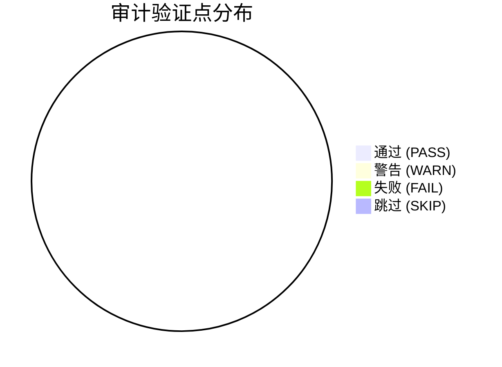

# 模板：标准审计报告

# 自动化审计验证报告 (V3.0 深度审计版)

> [!NOTE]
> **验证模块**: `模块名`
> **审计目标**: `目标标识/账号/单号/日期`
> **生成时间**: `YYYY-MM-DD HH:mm:ss`
> **环境**: `Production-Sim`

## 使用说明

- 本模板就是 `playwright-common` 的标准审计报告结构。
- 项目内已有 reporter 时，应按该标准结构生成报告；没有统一 reporter 时，可参考 `examples/audit-reporter-integration.md`。
- 正式生成时，报告目录应使用项目已有约定；没有约定时，可采用 `reports/Audit_{moduleName}_{targetId}_{timestamp}/`。
- 主文件通常为 `index.md`，截图与报告同目录存放，并在证据列内联展示。
- 若脚本已使用 `logWithSection`，章节顺序优先为：`正常流`、`边界流`、`异常流`。
- 若脚本未分章节，也允许只保留一个总表，但当前项目更推荐按章节聚合。

## 📊 审计执行摘要



## 📜 审计流水线 (Evidence Chain)

### 正常流

| 环节 | 状态 | 验证详情 | 观测值 | 审计结论与视觉证据 |
| --- | --- | --- | --- | --- |
| 新增闭环 | ✅ `PASS` | 提交成功，主链路跑通 | **UI**: 出现成功提示<br/>**API**: 保存接口返回成功 | **结论**: 新增结果与列表回显一致<br/><br/> |
| 唯一键回查 | ⚠️ `WARN` | 命中目标数据，但部分字段未在列表稳定展示 | **UI**: 列表未展示手机号<br/>**API**: 详情接口存在手机号值 | **结论**: 字段改由 API 回查，不判为脚本失败<br/><br/> |

### 边界流

| 环节 | 状态 | 验证详情 | 观测值 | 审计结论与视觉证据 |
| --- | --- | --- | --- | --- |
| 必填校验 | ✅ `PASS` | 留空提交后出现红字校验提示 | **UI**: 表单出现必填提示 | **结论**: 前端校验生效<br/><br/> |
| 长度边界 | ✅ `PASS` | 输入超长值后被正确拦截 | **UI**: 出现长度限制提示<br/>**API**: 未发起保存接口 | **结论**: 边界规则生效，未发现静默截断<br/><br/> |

### 异常流

| 环节 | 状态 | 验证详情 | 观测值 | 审计结论与视觉证据 |
| --- | --- | --- | --- | --- |
| 保存接口 500 | ✅ `PASS` | mock 保存接口返回 500，页面提示失败且按钮恢复 | **UI**: 出现失败提示，按钮恢复可点击<br/>**API**: 保存接口状态为 500 | **结论**: 异常处置可控，未产生脏数据<br/><br/> |
| 接口超时恢复 | ❌ `FAIL` | 提交后长时间 loading 未结束 | **UI**: 按钮持续 loading<br/>**API**: 请求超时无有效恢复 | **结论**: 页面未提供稳定恢复机制<br/><br/> |

---

## 🔌 附录：审计接口原证快照

<details>
<summary><b>点击展开: 查询接口响应</b></summary>

**Request:**
```json
{
  "keyword": "demo-user"
}
```

**Response:**
```json
{
  "code": 200,
  "data": {
    "total": 1,
    "records": [
      {
        "username": "demo-user"
      }
    ]
  }
}
```

</details>

<details>
<summary><b>点击展开: 保存接口响应</b></summary>

**Request:**
```json
{
  "username": "demo-user",
  "status": 1
}
```

**Response:**
```json
{
  "code": 200,
  "msg": "操作成功"
}
```

</details>

## 🗄️ 附录：外部数据原证快照（可选）

当场景使用 DB、文件、消息事件或其它外部数据源时，建议用折叠块记录原证。未使用外部数据源时可省略本章节。

<details>
<summary><b>点击展开: 持久化查询或外部数据检查</b></summary>

**Source:**
```text
DB / file / event / queue / cache
```

**Query Or Operation:**
```text
SELECT ... WHERE business_key = ?
```

**Result:**
```json
{
  "rowCount": 1,
  "sample": {
    "business_key": "demo-key"
  }
}
```
</details>

## 模板约束

- 表头必须优先对齐项目实际生成格式：`环节 | 状态 | 验证详情 | 观测值 | 审计结论与视觉证据`。
- `状态` 建议保持项目现状：`✅ PASS`、`⚠️ WARN`、`❌ FAIL`、`⏩ SKIP`。
- `观测值` 列优先按 `UI`、`API` 两段展示；没有值时统一写 `-`，不要留空。
- `审计结论与视觉证据` 列优先写 `**结论**:`，若有截图则使用相对路径内联图片。
- API 原证附录建议使用 `<details>` 折叠块，并保留 `Request/Response` 的原始 JSON。
- 外部数据原证附录建议使用 `<details>` 折叠块，并保留数据来源、查询/操作、结果摘要。
- 若外部依赖未配置但场景依赖该证据，不要标为 `PASS`；应按实际情况记录 `SKIP`、`WARN` 或 `FAIL`。
- 若脚本已按章节写入 `section`，最终报告章节命名应与脚本一致，优先使用 `正常流`、`边界流`、`异常流`。
